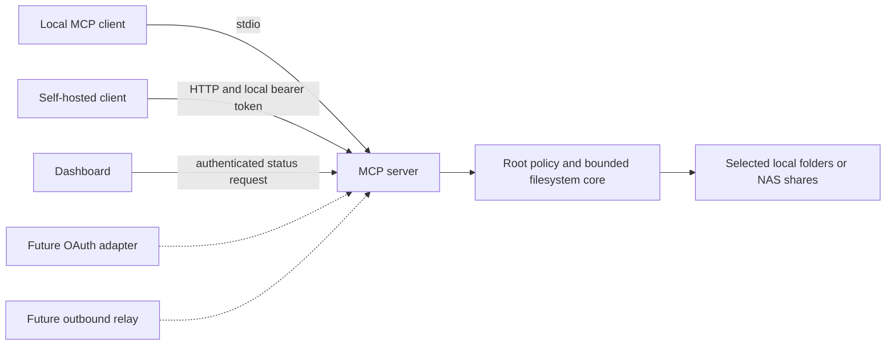

# Architecture

The NAS filesystem is the source of truth. Local directories and Synology mounted shares use the same `NasFiles` adapter. The process never logs into DSM: a DSM package runs under its own unprivileged package account and administrators grant that account read permissions to selected folders. Configuration is separate from the share data.

`packages/core` handles root aliases, path validation, denied entries, bounded filename scans and document reads. It has no transport, DSM API, identity provider, shell command or write operation. Config is schema-validated and snapshotted at process startup. Empty roots are valid and expose no data. The server bundle contains no native modules and runs under a separate Node.js v22 DSM dependency.

`apps/server` registers exactly five tools with MCP read-only annotations. HTTP uses a fresh SDK server/transport for each request, avoiding shared session identity and request-ID collisions. Stdio uses one server per local process. HTTP authenticates before JSON parsing, checks Host and Origin, restricts body size, and limits concurrency and a global request rate. `GET /healthz` discloses only liveness. `GET /api/status` requires authentication. No filesystem configuration is changed through HTTP.

`packages/auth` separates the transport from identity. `Authenticator` resolves a credential to a principal with `nas:read` and optional root IDs; MCP checks those root IDs before executing. Local tokens are generated from 32 random bytes and loaded from an owner-only file. In local-token mode no OAuth discovery is advertised. The metadata helper is a future configuration contract, not a working OAuth implementation.

## Later phases

1. Implement a complete MCP OAuth provider or integrate an established provider, with PKCE S256, resource/audience binding, issuer verification, expiry, root grants and revocation. Authenticate each HTTP request and publish protected-resource metadata only with a working provider.
2. Evaluate Sign in with ChatGPT as a separate identity flow. The current open-source loopback flow needs a browser-local callback; NAS deployments need a verified hosted identity option or a browser-local companion. An OpenAI token must never become a NAS authorization credential by accident.
3. Add optional device pairing and an outbound authenticated relay. Device keys, account/root grants, per-device quotas and token revocation must be designed before enabling it. A relay sees plaintext if it terminates TLS; do not claim end-to-end encryption. Retention and audit policy need explicit documentation.
4. Add a DSM-specific configuration editor only after DSM session/CSRF authentication is implemented. v0.1 uses administrator-edited config and an authenticated status dashboard.

There is no background content indexing, database, cloud relay, OpenAI inference call or automatic plugin registration in v0.1. Future work is isolated at adapters rather than embedded into file access.
