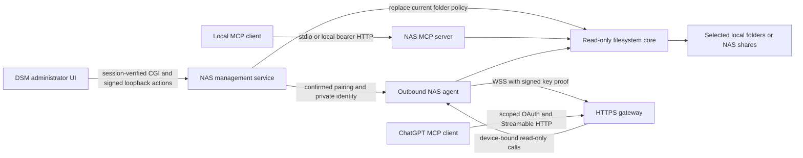

# Architecture

The NAS filesystem is the source of truth. Local directories and Synology mounted shares share the same `NasFiles` adapter. The service runs as an unprivileged DSM package account; administrators grant that account read permissions. Configuration and private connection state stay outside selected shares.

## Core and local transports

`packages/core` owns aliases, validation, denied entries, bounded filename scans, metadata and UTF-8 reads. It has no DSM API, transport, identity provider, shell execution or write tool. Strict operation schemas are shared with the relay. Empty roots expose no data. The portable NAS bundle has no native modules or gateway SQLite dependency and runs on Node.js v22.

`apps/server` exposes exactly five tools with read-only annotations. HTTP creates an SDK server/transport for each request; stdio uses one server for the spawning process. Local HTTP authenticates before JSON parsing, checks Host/Origin and limits input, concurrency and rates. Its health endpoint exposes liveness only; status requires auth. `packages/auth` resolves credentials to principals and every tool checks scope/optional root grants. Local tokens are private random secrets, with no OAuth metadata in local-token mode.

## DSM management and NAS connection

`packages/management` separates configuration writes from data operations. The CGI verifies the existing DSM session and exact administrator group, then signs a fixed loopback request using a separate private HMAC key. Mutation actions require exact HTTPS Origin and administrator-bound CSRF. Neither the NAS bearer token nor a browser-supplied username grants management access.

The share catalog discovers permitted top-level shares and returns opaque IDs. Atomic private configuration writes publish a replacement filesystem provider; operations discard results when that provider changes. The connection controller uses that same live provider. Explicit destination consent and unchanged provider bind each pending pairing to its initiating administrator. The browser sees public pairing/comparison codes, not private polling credentials, signed proof material or the NAS key.

Confirmed pairing persists a private Ed25519 identity plus gateway/device state. Only then does the agent start. Startup validates existing private state and key identity; it never silently replaces a missing paired key. Gateway HTTP/WSS destinations use public-only DNS validation and pinned lookup answers, HTTPS/WSS certificate verification and no redirects. Disconnect stops the agent, persists disabled state and sends a signed timestamp/nonce-bound gateway revocation. Offline revocation remains pending. See [DSM flow and recovery](dsm-management.md).

## Gateway and authorization

`packages/gateway` owns the separate private SQLite store, MCP OAuth authorization-code/PKCE protocol, resource binding, durable first-party browser sessions, NAS ownership pairing and folder consent. The gateway's own installation key binds persistent authorization state. Its native CLI or Docker target supplies TLS/listener limits, private initialization, graceful shutdown and health checks; it is never bundled inside the SPK.

`packages/relay` supplies the pure pairing/protocol contracts, private NAS identity, public-only gateway client and outbound agent. The gateway binds each authenticated channel to a verified device and principal; callers cannot choose an arbitrary NAS by submitted identifier. Both gateway and NAS enforce folder scope and validate results. Cancellation, policy changes and grant/device revocation discard in-flight content. See [relay bounds and privacy](relay.md).

TLS terminates at the gateway, which sees requested file data in memory. It does not persist/log document bodies; operator hosting must uphold that policy. This is not E2E encryption. There is no content index, file modification tool, OpenAI inference call or automatic plugin registration.

## Remaining integration gates

Sign in with ChatGPT is a separate identity route and remains unimplemented. The supported loopback flow reaches the browser's computer, not a remote NAS; any hosted route needs official eligibility and exact callback validation. OpenAI inference credentials never become NAS authorization credentials.

Real DSM authentication/ACLs, installation/upgrade/reboot, approved public hosting and real ChatGPT discovery/consent/read/revocation remain required. The [product acceptance record](product-plan.md) distinguishes implemented components and fixture evidence from these release gates.
